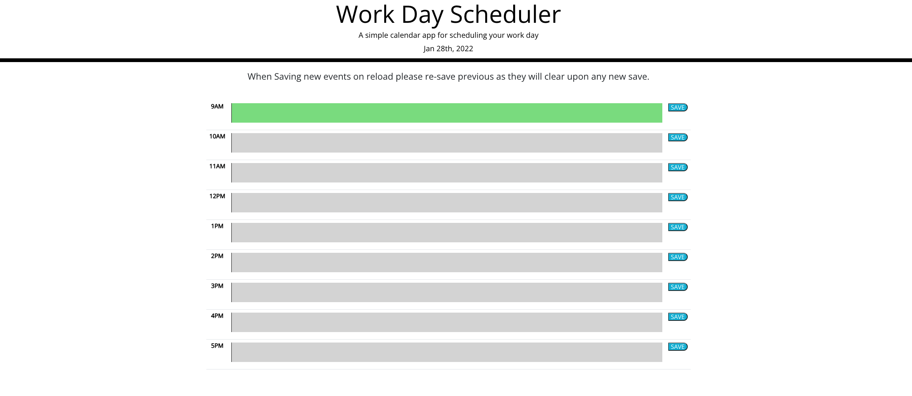
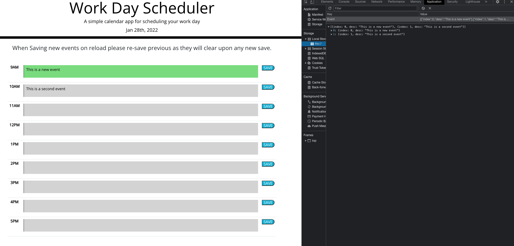

# Work-Day-Scheduler

## User Story

```md
AS AN employee with a busy schedule
I WANT to add important events to a daily planner
SO THAT I can manage my time effectively
```

## Acceptance Criteria

```md
GIVEN I am using a daily planner to create a schedule
WHEN I open the planner
THEN the current day is displayed at the top of the calendar
WHEN I scroll down
THEN I am presented with timeblocks for standard business hours
WHEN I view the timeblocks for that day
THEN each timeblock is color coded to indicate whether it is in the past, present, or future
WHEN I click into a timeblock
THEN I can enter an event
WHEN I click the save button for that timeblock
THEN the text for that event is saved in local storage
WHEN I refresh the page
THEN the saved events persist
```
***
### This is the colour coated page created...


***
### This is the page saving user entered events in local storage...


## Implementation
I started by adding the libraries needed to complete the task
```html
<!-- My scripts in order to achieve functionality in script.js -->
    <!-- jquery -->
    <script src="https://code.jquery.com/jquery-3.5.1.min.js"></script>
    <!-- moment.js -->
    <script src="https://cdnjs.cloudflare.com/ajax/libs/moment.js/2.27.0/moment.min.js"></script>
    <!-- My javascript -->
    <script src="./Assets/scripts/script.js"></script>
```

I then created the table elements in the `index.html` Each table row has the time, user input field, and a save button.
```html
<!-- Timeblocks go here -->
<!-- Table creation for each time block in a business day -->
<!-- Includes the time, a text area, and a save button -->
<table class="table mt-5">

<tr class="custom-row time-block">
    <th scope="row" class="hour" data-time="9">9AM</th>
    <td class="vw-100"><textarea class="description col-12"></textarea></td>
    <td><button type="button" class="saveBtn">SAVE</button> </td>
</tr>
```
I then started creating my javascript to functionally access DOM elements in order to change colors, and save data.
Using moment.js I was able to create and format the date and time. I used this to compare it with my time values made in the
`index.html` 

Here is a sample of how it was done...
```js
// setting the current date and time using moment.js
let currentTime = moment();
// Setting the current day at the top of the page
$("#currentDay").text(currentTime.format("MMM Do, YYYY"));
// Function that sets the colors based of each time block 
// based on the time of day
function setColors ()
{
    let hours = currentTime.format("H");
    let calTime = $("[data-time]");

    // Loop through each time block and change color 
    // and change it depending if its the past, present, or future
    for(let i = 0; i < calTime.length; i++)
    {
        let calHour = $("[data-time]").eq(i).attr("data-time");

        if(calHour < hours)
        {
            $("textarea").eq(i).addClass("past");
        }
        
        if(calHour === hours)
        {
            $("textarea").eq(i).addClass("present");
        }

        if(calHour > hours)
        {
            $("textarea").eq(i).addClass("future");
        }
    }
    
}
```
### You can view the deployed application via [Work-Day-Scheduler](https://nkrilis.github.io/Work-Day-Scheduler/) 
### You can also view my javascript here [script.js](./Assets/scripts/script.js)
### Thank you for reading me :smiley:
